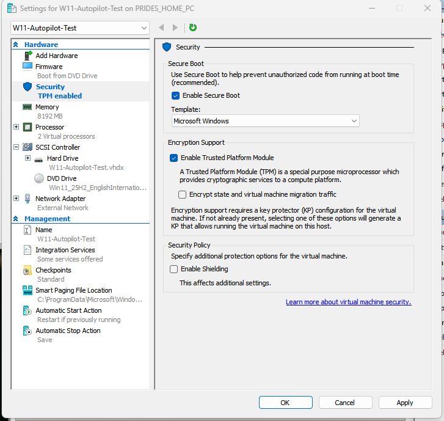

# Intune + Autopilot Lab

**Status:** In progress. The Hyper-V virtual machine is built and checkpointed; Autopilot registration is the next phase.

## Project Goal
Build a working Microsoft Intune and Windows Autopilot lab that provisions a new starter's Windows 11 device from first boot, with no hands-on imaging at the desk.

## Lab Scenario

**"New Starter Device Provisioning – TechCorp UK"** (a fictional company)

A new employee is joining. Instead of building and imaging a laptop by hand, IT registers the device for Autopilot in advance. On first boot the device enrols into Intune, picks up the organisation's branding, security settings and required apps, and the user signs in with their own account.

This mirrors the device deployment and endpoint management duties in 1st and 2nd line and deskside support job descriptions. In my previous IT role I built and configured staff devices by hand, so this lab is about learning the modern, cloud-managed way of doing the same job.

---

## What I Have Done So Far (1 July 2026)

I made two build attempts on the same day on two machines. The first, on my laptop, was abandoned because downloading the 6.5 GB Windows 11 ISO was too slow on that connection. I moved to my home desktop that evening and completed the VM build there.

| Step | Result | Evidence |
|---|---|---|
| Enable Hyper-V | Confirmed `State : Enabled` with `Get-WindowsOptionalFeature` after a restart | [Screenshot](../assets/01-intune-autopilot/03-hyperv-enabled.png) |
| Create an external virtual switch | "External Network" bound to the host's wireless adapter so the VM can reach the internet | [Screenshot](../assets/01-intune-autopilot/04-external-virtual-switch.png) |
| Build the VM | `W11-Autopilot-Test`: Generation 2, 8,192 MB memory, 64 GB dynamically expanding VHDX, Windows 11 25H2 ISO | [Screenshot](../assets/01-intune-autopilot/05-new-vm-wizard-summary.png) |
| Enable Secure Boot and the virtual TPM | Both enabled in the VM's security settings; Autopilot and Windows 11 need TPM 2.0 | [Screenshot](../assets/01-intune-autopilot/06-vm-secure-boot-tpm.png) |
| Take a clean checkpoint | "Pre-OOBE – Fresh", so the VM can be reset to first boot for every test run | [Screenshot](../assets/01-intune-autopilot/07-pre-oobe-checkpoint.png) |

### Problems I Hit and How I Fixed Them

1. **Wrong character in a parameter.** `Get-WindowsOptionalFeature _Online -FeatureName Microsoft-Hyper-V` failed with "A positional parameter cannot be found that accepts argument '_Online'". I had typed an underscore instead of a dash, so PowerShell treated `_Online` as a value rather than a parameter. Retyping it as `-Online` fixed it. ([screenshot](../assets/01-intune-autopilot/01-typo-online-parameter.png))
2. **Stray redirection operator.** On the desktop, the same command failed with "Missing file specification after redirection operator". A `>>` had ended up at the end of the line, which tells PowerShell to append the output to a file, and no file was named. Re-running the clean command returned the feature status as expected. ([screenshot](../assets/01-intune-autopilot/02-redirection-operator-error.png))
3. **Slow connection.** Rather than fight a 6.5 GB download on a slow link, I switched to the machine with the faster connection and restarted the build there.

---

## Next Steps

1. Start the Microsoft 365 Business Premium trial (Intune plus Entra ID P1), timed so this lab and [Project 03](../03-Entra-ID-Conditional-Access/) both fit inside the 30-day window.
2. Boot the VM from the checkpoint, open a command prompt at the out-of-box screen (Shift+F10) and register the hardware hash with `Get-WindowsAutopilotInfo -Online`.
3. Create the Autopilot deployment profile (user-driven, Entra ID join) and the Enrollment Status Page.
4. Build the configuration profiles, a compliance policy (BitLocker, password or Windows Hello) and a Win32 app package (7-Zip).
5. Reset to the checkpoint and run the full end-to-end test, then record the results here with screenshots.

The full phase-by-phase plan, with commands and settings, is in [BUILD-PLAN.md](BUILD-PLAN.md).

## Progress

| Phase | Status |
|---|---|
| Scope, scenario and licensing research | Complete |
| Hyper-V host and Windows 11 VM build | Complete (1 July 2026) |
| M365 trial tenant, users and groups | Not started |
| Autopilot registration | Not started |
| Deployment profile and ESP | Not started |
| Configuration profiles and compliance policy | Not started |
| Win32 app packaging and deployment | Not started |
| End-to-end test | Not started |

## Tools
Hyper-V, Windows 11 25H2, PowerShell 5.1, Microsoft Intune, Windows Autopilot, Microsoft Entra ID, Win32 Content Prep Tool (`IntuneWinAppUtil.exe`)
